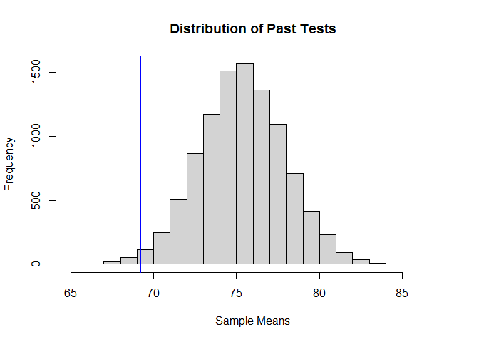
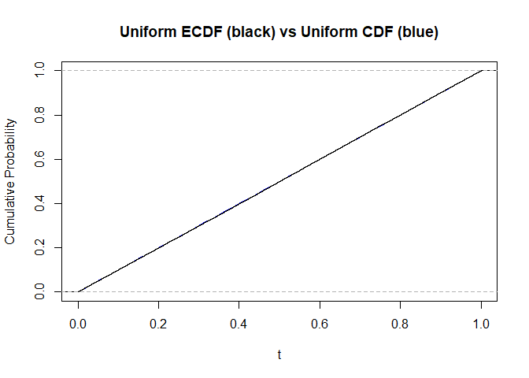

<!-- README.md is generated from README.Rmd. Please edit that file -->

# simboil

<!-- badges: start -->
<!-- badges: end -->

The goal of simboil is to stream line simulation workflows. It hopes to
bring simmering simmering simmering simulations to a boil.

## Installation

You can install the development version from
[GitHub](https://github.com/) with:

``` r
# install.packages("devtools")
devtools::install_github("mncube/simboil")
```

## Use Monte Carlo simulation to test a condition

The default setting of simtest simulates a coin flip and tests whether
10 flips has 3 or more head (where head is defined as 1). The function
and example was inspired by A Beginner’s Guide to Monte Carlo
Simulations presented by Dan Uehara for UseR Oslo:
<https://www.youtube.com/watch?v=g2Uu9m0IlFE>

``` r
library(simboil)
coinflips <- simtest()
mean(coinflips)
#> [1] 0.97
```

## Use simulation to get quantiles

In the example below, simq is used to compare a practice test to the
test mean and standard deviation from the past 3 years

``` r
#Test scores from the new test administered over the past 3 years is not 
#available but the mean (75) and sd (14) is known
sim_scores <- as.vector(rnorm(1000, 75, 14))

#Practice test scores for low performing math class 
practice_test <- as.vector(rnorm(30, 68, 7))

#See how low performers compare to past performers

#Run simulation
getqs <- simq(frame = sim_scores, ref_samp = practice_test, 
              main = "Distribution of Past Tests", xlab = "Sample Means")
```



``` r
#Get requested quantiles (example uses defaults of lowp = .025, highp = .975)
getqs$quantiles
#>    2.5%   97.5% 
#> 70.7006 80.9246

#Compare practice test to distribution of past tests
getqs$histogram
#> $breaks
#>  [1] 66 67 68 69 70 71 72 73 74 75 76 77 78 79 80 81 82 83 84 85 86
#> 
#> $counts
#>  [1]    2   13   37   77  203  444  728 1039 1382 1494 1466 1244  848  505  289
#> [16]  159   44   21    3    2
#> 
#> $density
#>  [1] 0.0002 0.0013 0.0037 0.0077 0.0203 0.0444 0.0728 0.1039 0.1382 0.1494
#> [11] 0.1466 0.1244 0.0848 0.0505 0.0289 0.0159 0.0044 0.0021 0.0003 0.0002
#> 
#> $mids
#>  [1] 66.5 67.5 68.5 69.5 70.5 71.5 72.5 73.5 74.5 75.5 76.5 77.5 78.5 79.5 80.5
#> [16] 81.5 82.5 83.5 84.5 85.5
#> 
#> $xname
#> [1] "samps"
#> 
#> $equidist
#> [1] TRUE
#> 
#> attr(,"class")
#> [1] "histogram"
```

## Compare the empirical cdf to the true cdf using the plots

Plot the empirical vs true cdf for the uniform distribution as follows:

``` r
evt_cdf(ylab = "Cumulative Probability", col = "blue", main = "Uniform ECDF (black) vs Uniform CDF (blue)")
```


To get a more accurate ECDF plot, increase the number of samples using n

``` r
evt_cdf(n = 10^5, ylab = "Cumulative Probability", col = "blue", main = "Uniform ECDF (black) vs Uniform CDF (blue)")
```



You can also change from the uniform distribution to other distributions
such as the normal distribution by using anonymous functions

``` r
evt_cdf(n = 10^5, ylab = "Cumulative Probability", col = "blue", main = "Normal ECDF (black) vs Normal CDF (blue)",
        remp = function(x)stats::rnorm(x),
        ptrue = function(x)stats::pnorm(x))
```


